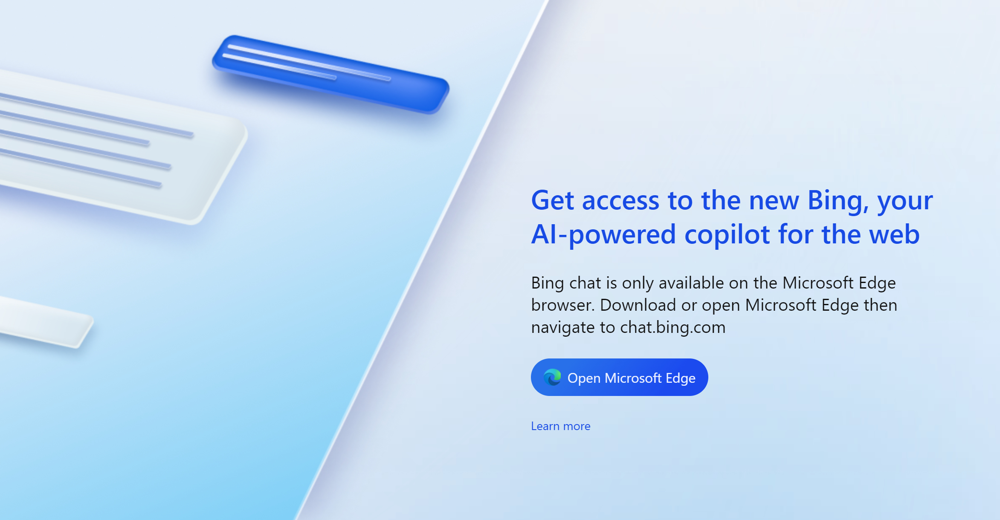

#  [Bing AI for Chrome](https://chrome.google.com/webstore/detail/bing-ai-for-chrome/oofdkcckpabclngcdjnkhlldcfadlfmh) 

This add-on removes the limits of Microsoft Copilot / Bing AI (ChatGPT v4) for Google Chrome and other browsers by setting appropriate features for the browser.

[Install from Chrome Web Store](https://chrome.google.com/webstore/detail/bing-ai-for-chrome/oofdkcckpabclngcdjnkhlldcfadlfmh)

## Brave Browser

The latest version of Brave has a [bug](https://github.com/brave/brave-browser/issues/30785) that breaks the functionality so please download and install the separate package manually (Chrome Webstore doesn't support extensions with manifest v2). 

[Download ZIP package for Brave](https://github.com/patrik-martinko/app-bing-ai-for-chrome/releases/download/1.1.1/extension-brave.zip)

## With the add-on in Brave

## Without the add-on

