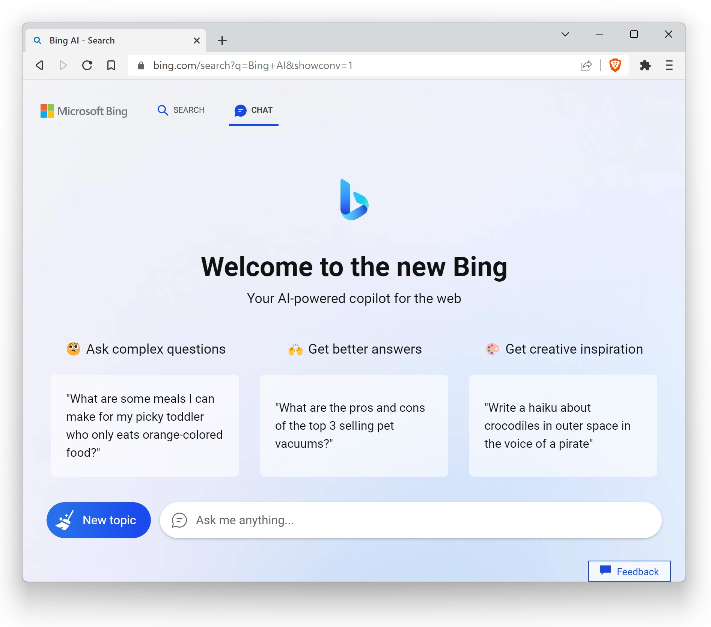
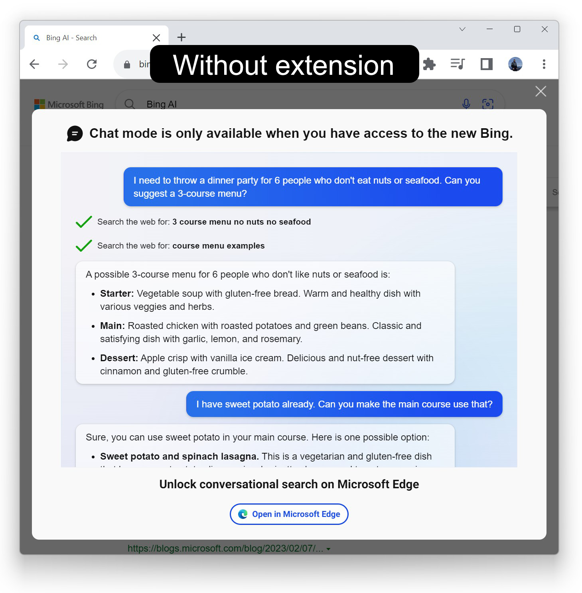

#  [Bing AI for Chrome](https://chrome.google.com/webstore/detail/bing-ai-for-chrome/oofdkcckpabclngcdjnkhlldcfadlfmh) 

Allows using Bing AI chatbot with Google Chrome and other Chromium browsers.

[Install from Chrome Web Store](https://chrome.google.com/webstore/detail/bing-ai-for-chrome/oofdkcckpabclngcdjnkhlldcfadlfmh)

## Brave Browser

The latest version of Brave has a [bug](https://github.com/brave/brave-browser/issues/30785) that breaks the functionality so please download and install the separate package manually (Chrome Webstore doesn't support extensions with manifest v2). 

## With extension in Brave

## Without extension

